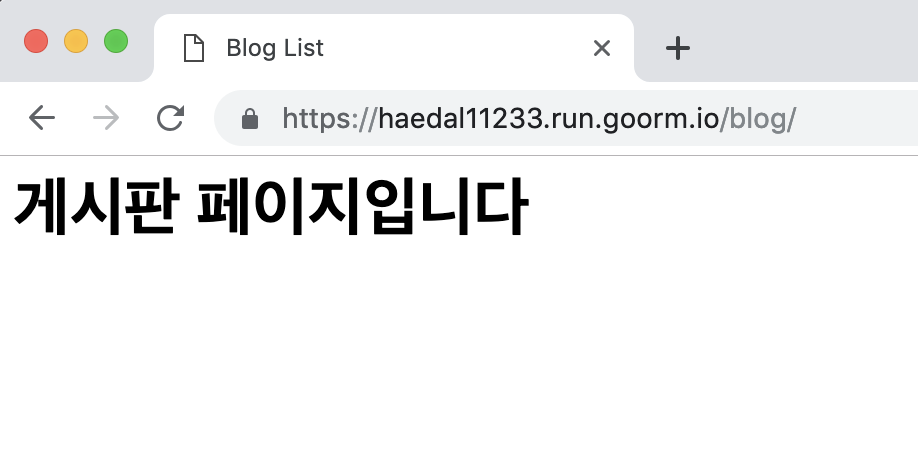
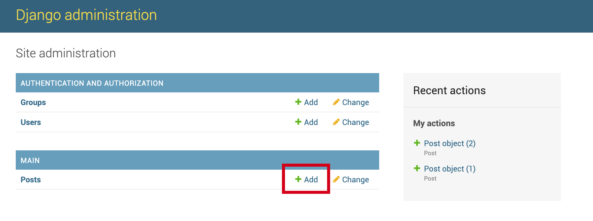
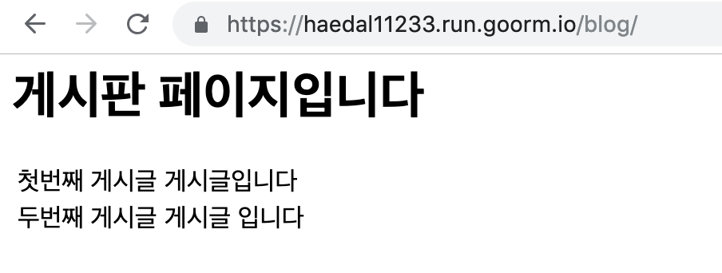
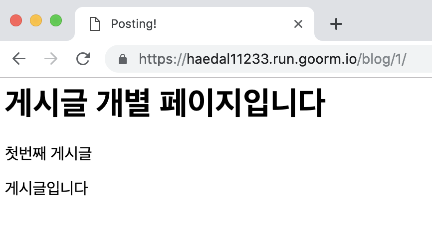
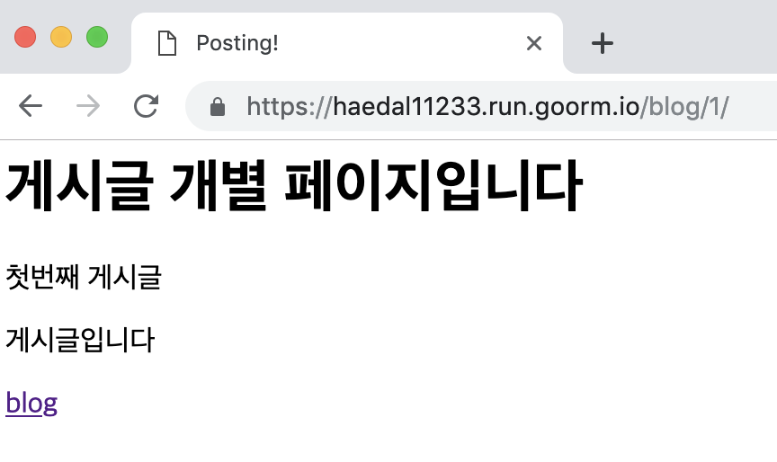
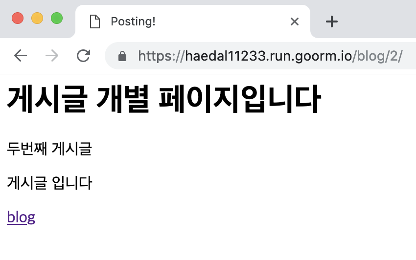

# 게시판 만들기

### `Django`의 구조
`Django`는 `MVC`모델을 `MTV`라고 부릅니다  
`MVC` 구조가 학계의 정설이지만 `Django`에선 `MTV`라고 이야기합니다.  
자세한 내용은 아래의 문서를 참고하시면 됩니다.  

[Django의 MTV 패턴](https://jayzzz.tistory.com/68)  
[Django의 개발 방식 - MTV 패턴](https://revidream.tistory.com/16)  
[MVC 패턴이란?](https://medium.com/@jang.wangsu/%EB%94%94%EC%9E%90%EC%9D%B8%ED%8C%A8%ED%84%B4-mvc-%ED%8C%A8%ED%84%B4%EC%9D%B4%EB%9E%80-1d74fac6e256)  
[위키피디아 - MVC 패턴](https://ko.wikipedia.org/wiki/%EB%AA%A8%EB%8D%B8-%EB%B7%B0-%EC%BB%A8%ED%8A%B8%EB%A1%A4%EB%9F%AC)  


#### `MTV`
장고의 `MTV`패턴은 자바 웹 프로그래밍의 `MVC`패턴과 거의 동일한 개념으로,   
웹 프로그래밍 영역을 3가지 개념으로 나눠서 개발하는 방식입니다.   


`MTV`는 3가지 영역으로 구분해 개발을 정의합니다

* DB 테이블을 정의하는 `Model`
* 사용자가 보는 화면을 정의하는 `Template`
* 에플리케이션의 제어 흐름 및 처리 로직을 정의하는 `View`  

이렇게 3가지로 나눠 개발하면 `Model`,`Template`,`View` 모듈 간에 독립성을 유지할 수 있고  
디자이너, 개발자, DB 설계자 간에 협업도 쉬워집니다

#### `CRUD`
`CRUD`는 대부분의 컴퓨터 소프트웨거 가지는 기본적인 데이터 처리 기능인  
Create(생성), Read(읽기), Update(갱신), Delete(삭제)를 묶어서 일컫는 말입니다.  


|  이름  | 조작 |   SQL  |
|:------:|:----:|:------:|
| Create | 생성 | INSERT |
|  Read  | 읽기 | SELECT |
| Update | 갱신 | UPDATE |
| Delete | 삭제 | DELETE |

# [첫 페이지 만들기](https://github.com/haedal-with-knu/djangoBootcamp/blob/master/firstPage.md) 코드 가져오기

`첫 페이지 만들기` 강의에서 만든 코드를 정리해두었습니다  
가져옵니다
```console
root@goorm:/workspace/djangoBootcamp# git clone https://github.com/kei01138/bootCamp_Week2
```

`bootCamp_Week2` 폴더 내부의 `mysite` 폴더를 밖으로 꺼냅시다  
마우스로 왼쪽의 폴더 트리에서 꺼내도 되고,  
리눅스 커맨드를 이용해 꺼내도 됩니다  
```console
root@goorm:/workspace/djangoBootcamp# mv bootCamp_Week2/mysite/ /workspace/djangoBootcamp/mysite
```
지난 강의가 마무리될 때 코드와 동일한 상황입니다

## 목록 페이지 만들자

`mysite/djangobootcamp/urls.py`
```python
from django.contrib import admin
from django.urls import path
# index는 대문, blog는 게시판
from main.views import index, blog

urlpatterns = [
    path('admin/', admin.site.urls),
    # 웹사이트의 첫화면은 index 페이지이다
    path('', index),
    # URL:80/blog에 접속하면 blog 페이지
    path('blog/', blog),
]
```

`mysite/main/views.py`
```python
from django.shortcuts import render

# index.html 페이지를 부르는 index 함수
def index(request):
    return render(request, 'main/index.html')

# blog.html 페이지를 부르는 blog 함수
def blog(request):
    return render(request, 'main/blog.html')
```

`mysite/main/templates/main/blog.html`
```html
<html>
    <head>
        <title>Blog List</title>
    </head>
    <body>
        <h1>게시판 페이지입니다</h1>
    </body>
</html>
```
  
위의 페이지가 뜨면 성공!  


서버를 어떻게 실행했는지 기억나시나요?
### `웹서버 실행` 복습  

**프로젝트를 실행할때마다 반복해서 사용하는 명령어입니다**  
파이썬 가상환경 설정 
```console
root@goorm:/workspace/djangoBootcamp/mysite# source myvenv/bin/activate
```
이제 `django` 웹서버를 실행합시다   
구름 IDE를 사용하는 경우  
상단 메뉴바의 `프로젝트 -> 실행 URL과 포트`에서   
80번 포트를 설정 후 접속합니다
```console
(myvenv) root@goorm:/workspace/djangoBootcamp/mysite# python manage.py runserver 0:80 
```
## `Model` 만들기

게시판에서 각각의 게시글에 저장될 공간을 만듭니다.  
`Post` 게시글 마다 `postname`(제목), `contents`(내용)이 존재합니다.  
이를 파이썬으로 구현해봅니다.

`mysite/main/models.py`
```python
from django.db import models

# Create your models here.
# 게시글(Post)엔 제목(postname), 내용(contents)이 존재합니다
class Post(models.Model):
    postname = models.CharField(max_length=50)
    contents = models.TextField()
```
모델을 만들었고 이제 `django`의 db에 `migrate`해줍니다  
게시글마다 제목과 내용을 저장합니다  

#### `Ctrl + C`를 눌러 웹서버를 종료 후 `migration`

```console
(myvenv) root@goorm:/workspace/djangoBootcamp/mysite# python3 manage.py makemigrations main
```

```console
(myvenv) root@goorm:/workspace/djangoBootcamp/mysite# python3 manage.py migrate
```
아래와 같이 진행된다면 `migration` 완료!   
  


### `Admin`에 권한
관리자(`admin`)이 게시글(`Post`)에 접근할 권한을 줍니다.  
게시글 게시, 삭제, 수정, 저장 등 여러 작업을 할 수 있게 합니다.  

`mysite/main/admin.py`
```python
from django.contrib import admin
# 게시글(Post) Model을 불러옵니다
from .models import Post

# Register your models here.
# 관리자(admin)가 게시글(Post)에 접근 가능
admin.site.register(Post)
```

### `Superuser` 만들기
`Superuser`는 `django` 프로젝트의 모든 `app` 및 `object`를 관리하는 계정입니다.  
`manage.py`를 통해 `Superuser`계정이 생성되며  
`username`, `email address`, 그리고 강한 `password`가 필요합니다.

```console
(myvenv) root@goorm:/workspace/djangoBootcamp/mysite# python3 manage.py createsuperuser
```

아래와 같이 `Superuser` 계정을 생성합니다.  
예측하기 쉬운 비밀번호의 경우 `django`가 다시 확인합니다  
 


서버를 키고 생성한 `Superuser` 계정을 확인합니다  

```console
(myvenv) root@goorm:/workspace/djangoBootcamp/mysite# python3 manage.py runserver 0:80
```
[http://자신의URL:80/admin](http://0:80/admin)으로 접속합니다  
`Superuser`의 아이디와 비밀번호를 입력해 관리자 페이지로 들어갑니다  
  

위의 페이지가 나오면 성공!  

### 게시글 작성하기
  
`add` 버튼을 눌러 게시글을 작성합니다

  

게시글을 2개 작성합니다  
`postname`과 `contents`를 구분하기 위해 다른 내용으로 작성합니다   
  
현재 코드에서 게시글을 작성하면  
게시글 제목이 나오지 않고 `Post object`로 나옵니다  
이를 `postname`이 `Post object` 대신 들어가도록 개선합니다  
이땐 게시글(`Post`)의 `model`을 개선합니다 

`mysite/main/models.py`
```python
from django.db import models

# Create your models here.
# 게시글(Post)엔 제목(postname), 내용(contents)이 존재합니다
class Post(models.Model):
    postname = models.CharField(max_length=50)
    contents = models.TextField()
    
    # 게시글의 제목(postname)이 Post object 대신하기
    def __str__(self):
        return self.postname
```
  

안의 내용을 알 수 없는 `Post Object` 대신  
게시글(`Post`)의 제목(`postname`)으로 개선했습니다 

### 목록(`blog`)페이지에 게시판 보여주자

입력한 게시글을 [http://0:80/blog](http://0:80/blog) 페이지에 띄워봅시다  

`MTV`패턴을 기억하나시나요?

`View`(`blog` 함수)가 `Model`(`Post` 게시글)을 가져오고,   
`Template`(`index.html`)에 `Model`(`Post` 게시글)을 뿌려줍니다  
아직 `MTV`패턴이 어색할텐데 직접 만들며 이해해봅니다.  

`mysite/main/views.py`  
`View`(`blog` 함수)가 `Model`(`Post` 게시글)을 가져옵니다
```python
from django.shortcuts import render
# View에 Model(Post 게시글) 가져오기
from .models import Post

# index.html 페이지를 부르는 index 함수
def index(request):
    return render(request, 'main/index.html')

# blog.html 페이지를 부르는 blog 함수
def blog(request):
    # 모든 Post를 가져와 postlist에 저장합니다
    postlist = Post.objects.all()
    # blog.html 페이지를 열 때, 모든 Post인 postlist도 같이 가져옵니다 
    return render(request, 'main/blog.html', {'postlist':postlist})
```

`mysite/main/templates/main/blog.html`  
`Template`(`index.html`)에 `Model`(`Post` 게시글)을 뿌려줍니다
```html
<html>
    <head>
        <title>Blog List</title>
    </head>
    <body>
        <h1>게시판 페이지입니다</h1>
        <!-- 게시판(postlist)의 게시글(list)을 하나씩 보여줍니다 -->
        <!--  내부엔 파이썬이 사용됩니다 -->
        <table>
        
            <tr>
                <td>{{list.postname}}</td>
                <td>{{list.contents}}</td>
            </tr>
        
        </table>
    </body>
</html>
```
  

아직 게시판이라 하기엔 부족한게 많습니다  
게시판에 있을 만한 요소들을 추가해봅니다  

### 게시글 세부페이지
게시글마다 `postdetails`세부페이지를 만들어봅니다  
`mysite/main/views.py`  
`posting.html`게시글-세부페이지에 특정 `post` 1개만 가져옵니다    
```python
from django.shortcuts import render
# View에 Model(Post 게시글) 가져오기
from .models import Post

# index.html 페이지를 부르는 index 함수
def index(request):
    return render(request, 'main/index.html')

# blog.html 페이지를 부르는 blog 함수
def blog(request):
    # 모든 Post를 가져와 postlist에 저장합니다
    postlist = Post.objects.all()
    # blog.html 페이지를 열 때, 모든 Post인 postlist도 같이 가져옵니다 
    return render(request, 'main/blog.html', {'postlist':postlist})

# blog의 게시글(posting)을 부르는 posting 함수
def posting(request, pk):
    # 게시글(Post) 중 pk(primary_key)를 이용해 하나의 게시글(post)를 찾습니다
    post = Post.objects.get(pk=pk)
    # posting.html 페이지를 열 때, 찾아낸 게시글(post)을 같이 가져옵니다 
    return render(request, 'main/posting.html', {'post':post})
```


`mysite/djangobootcamp/urls.py`  
첫번째 게시글 세부페이지 들어가기 - [http://0:80/blog/1](http://0:80/blog/1)  
```python
from django.contrib import admin
from django.urls import path
# index는 대문, blog는 게시판
from main.views import index, blog, posting

urlpatterns = [
    path('admin/', admin.site.urls),
    # 웹사이트의 첫화면은 index 페이지이다 + URL이름은 index이다
    path('', index, name='index'),
    # URL:80/blog에 접속하면 blog 페이지 + URL이름은 blog이다
    path('blog/', blog, name='blog'),
    # URL:80/blog/숫자로 접속하면 게시글-세부페이지(posting)
    path('blog/<ink:pk>',posting, name="posting"),
]

```

`mysite/main/templates/main/posting.html`  

개별 게시글을 보여줍니다  

```html
<html>
    <head>
        <title>Posting!</title>
    </head>
    <body>
        <h1>게시글 개별 페이지입니다</h1>
        <p>{{post.postname}}</p>
        <p>{{post.contents}}</p>
    </body>
</html>
```
  

게시글-세부페이지 완성!

### `blog.html`에서 `posting.html` 링크
`blog` 게시판에서 게시글을 클릭하면     
`posting` 세부페이지로 갑니다
##### `mysite/main/templates/main/blog.html`
`<tr>`태그에 onclick 요소를 넣어 클릭시 넘어가게 합시다  
`자기URL`위치에 자신의 URL을 넣습니다

```html
<html>
    <head>
        <title>Blog List</title>
    </head>
    <body>
        <h1>게시판 페이지입니다</h1>
        <!-- 게시판(postlist)의 게시글(list)을 하나씩 보여줍니다 -->
        <!-- {와 %로 이루어진 구문 내부엔 파이썬이 사용됩니다 -->
        <table>
        
            <!-- 게시글 클릭시 세부페이지로 넘어갑니다-->
            <tr onclick="location.href='자기URL/blog/{{ list.pk }}/'">
                <td>{{list.postname}}</td>
                <td>{{list.contents}}</td>
            </tr>
        
        </table>
    </body>
</html>
```
### `posting` 페이지에서 `blog`페이지로 링크

##### `mysite/main/templates/main/posting.html`
`<a href="자기URL/blog/">목록</a>`를 추가합니다  
`자기URL`은 자신의 url에 맞춰 수정합니다
`mysite/main/templates/main/posting.html`
```html
<html>
    <head>
        <title>Posting!</title>
    </head>
    <body>
        <h1>게시글 개별 페이지입니다</h1>
        <p>{{post.postname}}</p>
        <p>{{post.contents}}</p>
        <a href="자기URL/blog/">blog</a>
    </body>
</html>
```
`blog`로 가는 링크 추가!  

  
  

기본적인 게시판 만들기 재밌으셨나요?
수고하셨습니다