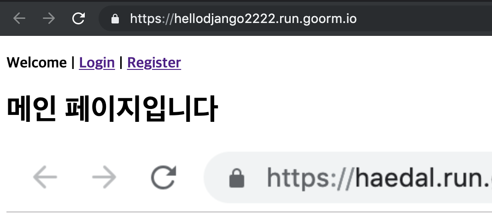
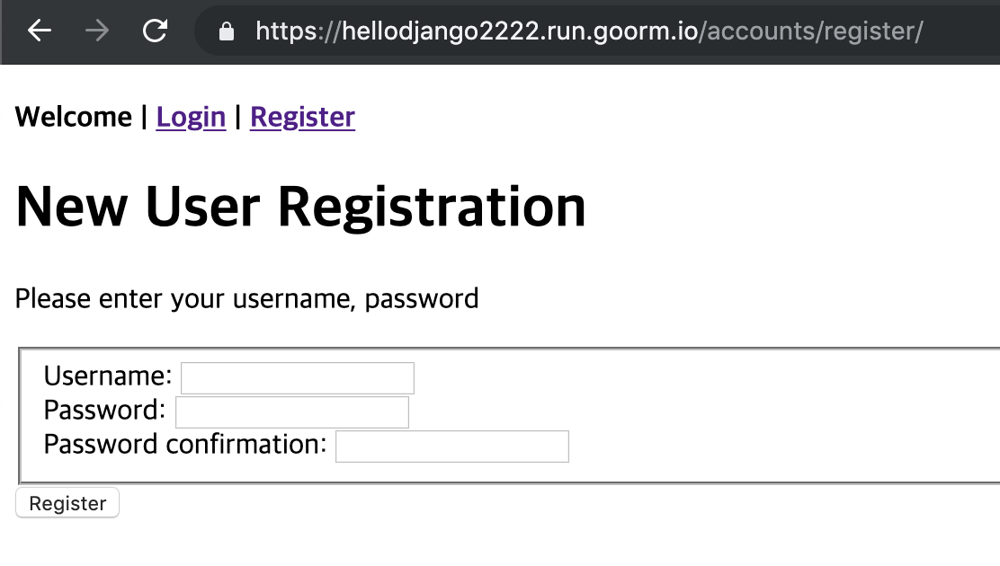
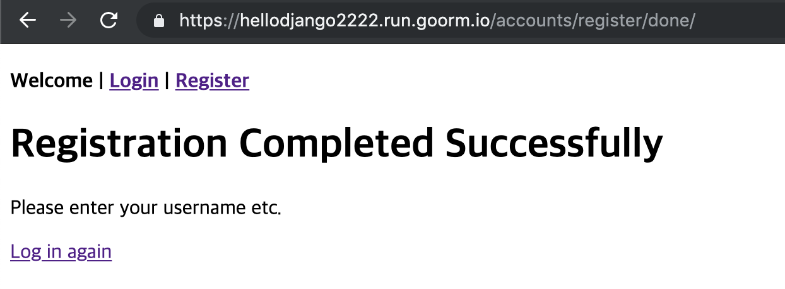
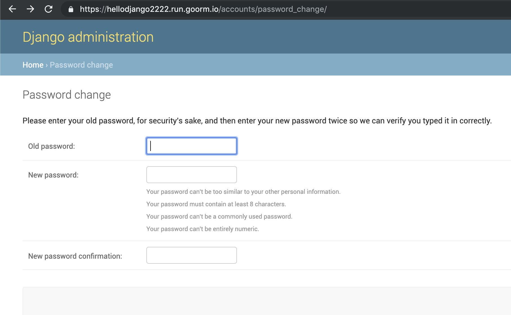
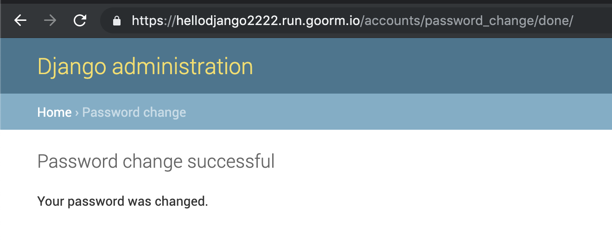
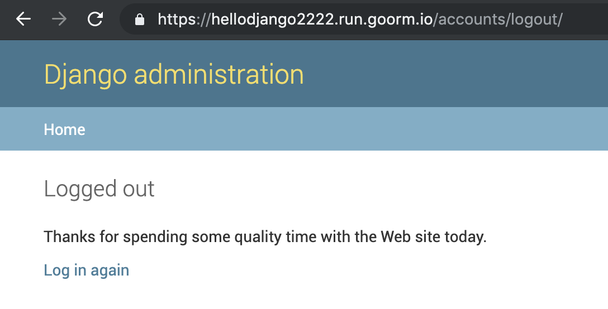

# Auth 인증 시스템 구현
> 웹 개발 시 필수 기능인 인증(`Auth`)기능을 만들어봅니다

인증 기능은 일반적으로 로그인 시 username/password를 인증(`authentication`)하는 것 외에도  
로그인한 사용자에 대한 권한(`authorization`)부여까지 포함됩니다.  
장고 엔진 내부에서 웹 요청 및 사용자 식별, 사용자별 세션 할당 및 관리 기능도 수행되는데,  
이런 세션 처리 기능도 인증 기능에 포함됩니다.

내용이 쉽지 않죠?  
똑똑한 장고가 자동으로 만들어주는 부분도 있고,  
프로그래머가 직접 만들어야하는 부분도 있습니다.  
코드로 직접 짜면서 부딪혀봅니다.  

# [기본적인 게시판 만들기](https://github.com/haedal-with-knu/djangoBootcamp/blob/master/dashboard.md) 코드 가져오기

`기본적인 게시판 만들기` 강의에서 만든 코드를 정리해두었습니다  
가져옵니다  
```console
root@goorm:/workspace/djangoBootcamp# git clone https://github.com/kei01138/bootCamp_Week3
```

`bootCamp_Week3` 폴더 내부의 `mysite` 폴더를 `bootCamp_Week3`,`manage.py`와 같은 위치에 있도록 밖으로 꺼냅시다  
`변경 후`
```
.
|-- bootcamp_Week3
    |-- ...
|-- mysite
|-- manage.py
|-- README.md
```
마우스로 왼쪽의 폴더 트리에서 꺼내도 되고,  
리눅스 커맨드를 이용해 꺼내도 됩니다  
```console
root@goorm:/workspace/djangoBootcamp# mv bootCamp_Week3/mysite/ /workspace/djangoBootcamp/mysite
```


## `웹서버 실행` 복습  

**프로젝트를 실행할때마다 반복해서 사용하는 명령어입니다**  
파이썬 가상환경 설정 
```console
root@goorm:/workspace/djangoBootcamp/mysite# source myvenv/bin/activate
```
이제 `django` 웹서버를 실행합시다   
구름 IDE를 사용하는 경우  
상단 메뉴바의 `프로젝트 -> 실행 URL과 포트`에서   
80번 포트를 설정 후 접속합니다
```console
(myvenv) root@goorm:/workspace/djangoBootcamp/mysite# python3 manage.py runserver 0:80 
```

# `frame.html` 템플릿 코딩하기
템플릿 상속을 이용해 사이트 전체의 외관을 통일합니다.  
공통 템플릿이므로 개별 애플리케이션 템플릿이 아닌 프로텍트 템플릿 디렉토리에 생성합니다.  
`mysite/main/templates` 위치에 `frame.html`을 만듭니다.  

기존의 `index.html`을 복사해와 뼈대를 잡습니다.  
`urls.py`, `views.py` 을 수정하고 다시 고치러 옵니다

`mysite/main/templates/frame.html`
```html
<html>
    <head>
        <title>Django Tutorial</title>
    </head>
    <body>
        <h1>메인 페이지입니다</h1>
        <!-- 정적 이미지 불러오기 -->
        
        
    </body>
</html>
```
`views.py`의 기존 index `함수`를 index `클래스`로 바꾸어  
`frame.html`을 상속하도록 합니다  

`mysite/main/views.py`
```python
from django.shortcuts import render
# View에 Model(Post 게시글) 가져오기
from .models import Post

# django의 제너릭 뷰를 사용합니다
from django.views.generic.frame import TemplateView


# TemplateView를 활용한 main/index/html 
class index(TemplateView):
    template_name = 'main/index.html'

# 하단 내용 동일
```
`mysite/djangobootcamp/urls.py`
```python
# 상단 내용 동일

urlpatterns = [
    path('admin/', admin.site.urls),
    # as_view()를 통해 index.html의 내용을 가져옵니다
    path('', index.as_view(), name='index'),
    ...
]
# 하단 내용 동일
```
프로젝트 템플릿 디렉터리를 설정합니다  
`mysite/djangobootcamp/settings.py`

```python
# mysite/main/templates
TEMPLATE_DIRS = [os.path.join(BASE_DIR, 'templates')]

```


`frame.html`를 통해 웹사이트의 구조를 잡아봅니다
`mysite/main/templates/frame.html`
```html
<!DOCTYPE html>
<html lang="ko">
<html>
    <head>
        <meta charset="UTF-8">
        <!-- 페이지 별 title 설정-->
        <title>Django Tutorial</title>
        <!-- 필요한 파일 및 CDN을 추가합니다-->
        
        <!-- 다음에 css를 만져봅니다-->
        <link rel="stylesheet" type="text/css" href="" />
        <link rel="stylesheet" href="" />
        
    </head>
    <body>
        <!-- 각 앱에서 만드는 페이지로 채울 부분-->
        
        <!-- footer가 있다면 사용할 부분 -->
        
    </body>
</html>
```

# `settings.py`에서 `URL` 설정
* `LOGIN_URL` : 로그인이 필요해 로그인 페이지로 리다이렉트 시키는 URL로, 디폴트로 `/accounts/login/` URL을 사용합니다
* `LOGOUT_URL` : 로그아웃시 사용하는 URL로, 디폴트로 `/accounts/logout/` URL을 사용합니다
* `LOGIN_REDIRECT_URL` : 로그인 처리가 성공한 후 사용하는 URL로, 디폴트로 `/accounts/profile/` URL을 사용합니다. 우리는 디폴트가 아닌 `/`로 이동합니다

`mysite/djangobootcamp/settings.py`  
```python
STATIC_URL = '/static/'
STATICFILES_DIRS = (
    # django와 static 폴더 연결
    os.path.join(BASE_DIR, 'static'),
)
# 상단 내용 동일

# Django에서 디폴트로 지정된 항목들
# LOGIN_URL = '/accounts/login/'
# LOGOUT_URL = '/accounts/logout/'
LOGIN_REDIRECT_URL = '/'
```

# `settings.py`에 설치된 앱 확인
`django` 내부에 설치된 `auth`를 기반으로 인증 시스템을 구현할 예정입니다  
처음 `startproject` 명령에 의해 `settings.py` 설정 파일이 만들어지는데,  
여기에 기본으로 `django.contrib.auth` 앱이 들어 있습니다.  
내부에 설치된 앱을 확인해봅니다    

`mysite/djangobootcamp/settings.py`
```python
INSTALLED_APPS = [
    'django.contrib.admin',
    # 장고 내부 인증 시스템 사용
    'django.contrib.auth',
    'django.contrib.contenttypes',
    'django.contrib.sessions',
    'django.contrib.messages',
    'django.contrib.staticfiles',
    # main 어플리케이션 추가
    'main',
]
```

# `Model` 코딩
똑똑한 장고는 인증 기능에 필요한 기본적인 내용을 지원합니다.  
우리는 회원가입 부분과 회원가입 완료 부분만 제작하면 됩니다.  
아래 표에서 마지막 2줄만 직접 제작하면 됩니다

| URL 패턴                        	| 뷰 이름                        	| 템플릿 파일명                                                                                                        	|
|---------------------------------	|--------------------------------	|----------------------------------------------------------------------------------------------------------------------	|
| /accounts/login/                	| login()                        	| registration/login.html                                                                                              	|
| /accounts/logout/               	| logout()                       	| registration/logged_out.html                                                                                         	|
| (개발자가 지정)                 	| logout_then_logout()           	| (개발자가 지정)                                                                                                      	|
| /accounts/passward_change/      	| password_change()              	| registration/password_change_form.html                                                                               	|
| /accounts/password_change/done/ 	| password_change_done()         	| registration/password_change_done.html                                                                               	|
| /accounts/password_reset/       	| password_reset()               	| registration/password_reset_form.html registration/password_reset_email.html registration/password_reset_subject.txt 	|
| /accounts/password_reset/done/  	| password_reset_done()          	| registration/password_reset_done.html                                                                                	|
| /accounts/reset/                	| password_reset_confirm()       	| registration/password_reset_confirm.html                                                                             	|
| /accounts/reset/done/           	| password_reset_complete()      	| registration/password_reset_complete.html                                                                            	|
| `/accounts/register/`             	| `UserCreateView(CreateView)`     	| registration/register.html                                                                                           	|
| `/accounts/register/done/`        	| `UserCreateDone(TemplateView)` 	| registration/register_done.html                                                                                      	|


`UserCreateView(CreateView)`(`/accounts/register/`)와   `UserCreateDone(TemplateView)`(`/accounts/register/done/`)을 추가합니다  


`mysite/djangobootcamp/urls.py`  
```python
# auth 추가
from django.contrib import admin
from django.urls import path
from django.conf.urls import include
# index는 대문, blog는 게시판
from main.views import index, blog, posting
# UserCreateView : 게정을 추가하는 View
# UserCreateDone : 계정 생성이 완료된 후에 보여줄 화면을 처리하는 View
from main.views import UserCreateView, UserCreateDone

urlpatterns = [
    path('admin/', admin.site.urls),
    # as_view()를 통해 index.html의 내용을 가져옵니다
    path('', index.as_view(), name='index'),
    # URL:80/blog에 접속하면 blog 페이지 + URL이름은 blog이다
    path('blog/', blog, name='blog'),
    # URL:80/blog/숫자로 접속하면 게시글-세부페이지(posting)
    path('blog/<int:pk>/', posting, name='posting'),
    
    # 인증 URL 3개 추가 
    path('accounts/', include('django.contrib.auth.urls')),
    path('accounts/register/', UserCreateView.as_view(), name='register'),
    path('accounts/register/done/', UserCreateDone.as_view(), name='register_done'),
    
]
```


뷰를 만들어봅니다.  
대부분 장고의 `auth`을 통해 만들어져 있어 건드릴게 없습니다.  
회원가입 부분을 만들어봅니다.  
`UserCreateView(CreateView)`와 `UserCreateDone(TemplateView)`을 추가합니다  


`mysite/main/views.py`
```python
from django.shortcuts import render
# View에 Model(Post 게시글) 가져오기
from .models import Post

from django.views.generic.base import TemplateView

# 인증 시스템에 사용할 라이브라리 및 함수 추가
from django.views.generic.edit import CreateView
from django.contrib.auth.forms import UserCreationForm
from django.core.urlresolvers import reverse_lazy

# User Creation
class UserCreateView(CreateView):
    template_name = 'registration/register.html'
    form_class = UserCreationForm
    success_url = reverse_lazy('register_done')

class UserCreateDone(TemplateView):
    template_name = 'registration/register_done.html'


# 하단 내용 동일
```

회원을 관리하는 부분을 만들어봅니다.  
HTML과 python을 섞어 씁니다.


`mysite/main/templates/frame.html`
```html
<!DOCTYPE html>
<html lang="ko">
<html>
    <head>
        <meta charset="UTF-8">
        <!-- 페이지 별 title 설정-->
        <title>Django Tutorial</title>
        <!-- 필요한 파일 및 CDN을 추가합니다-->
        
        <!-- 다음에 css를 만져봅니다-->
        <link rel="stylesheet" type="text/css" href="" />
        <link rel="stylesheet" href="" />
        
    </head>
    <body>
        <!-- 회원가입 부분 -->
        <div id="header">
            
                <h4>
                     |
                    <a href="">Change Password</a> |
                    <a href="">Logout</a>
                </h4>
            
                <h4>
                    Welcome |
                    <a href="">Login</a> |
                    <a href="">Register</a>
                </h4>
            
        </div>
        
        <!-- 하단 내용 동일 -->

```


인증에 필요한 페이지들을 만들어봅니다  
`mysite/main/templates` 폴더 안에 `registration` 폴더를 만들어봅니다  
인증에 필요한 페이지들  

```
|--registration
    |--login.html
    |--register.html
    |--register_done.html
    |--password_change_form.html
    |--password_change_done.html
    |--loggedout.html
```
`registration` 폴더와 `html`파일 만들기 

```console
(myvenv)root@goorm:/workspace/djangoBootcamp/mysite# mkdir main/templates/registration/
```
```console
(myvenv)root@goorm:/workspace/djangoBootcamp/mysite# cd main/templates/registration/
```
```console
(myvenv) root@goorm:/workspace/djangoBootcamp/mysite/main/templates/registration# touch login.html register.html register_done.html password_change_form.html password_change_done.html loggedout.html
```

로그인하는 화면을 만듭니다    

`mysite/main/templates/registration/login.html`
```html


Login





<div id="content">
    <h1>Please login</h1>
    <!-- 아이디, 비밀번호 입력창-->
    <form action="." method="post">
        <!-- 에러 표시-->
        
            <p class="errornote">Wrong! Please correct the errors below</p>
            
                
                    <div class="alert alert-danger">
                        <strong>{{ error|escape }}</strong>
                    </div>
                
            
        
        
        <p>Please enter your id and password</p>
        <fieldset class="aligned">
            <!-- 아이디 입력 -->
            <div class="form-row">
                {{ form.username.label_tag }} {{ form.username }}
            </div>
            <!-- 비밀번호 입력 -->
            <div class="form-row">
                {{ form.password.label_tag }} {{ form.password }}
            </div>
        </fieldset>
        <!-- 제출 -->
        <div class="submit-row">
            <input type="submit" value="Log in"/>
            <input type="hidden" name="next" value="{{ next }}"/>
        </div>
        <script type="text/javascript">document.getElementById('id_username').focus();
        </script>
    </form>
</div>

```


회원가입 페이지 만듭니다  
`mysite/main/templates/registration/register.html`
```html


Register





<div id="content">
    <h1>New User Registration</h1>
    <!-- 아이디, 비밀번호 입력창-->
    <form action="." method="post">
        <!-- 에러 표시-->
        
            <p class="errornote">Wrong! Please correct the errors below</p>
            
                
                    <div class="alert alert-danger">
                        <strong>{{ error|escape }}</strong>
                    </div>
                
            
        
        
        <p>Please enter your username, password</p>
        <fieldset class="aligned">
            <!-- 아이디 입력 -->
            <div class="form-row">
                {{ form.username.label_tag }} {{ form.username }}
            </div>
            <!-- 비밀번호 입력 1 -->
            <div class="form-row">
                {{ form.password1.label_tag }} {{ form.password1 }}
            </div>
            <!-- 비밀번호 입력 2 -->
            <div class="form-row">
                {{ form.password2.label_tag }} {{ form.password2 }}
            </div>
        </fieldset>
        <!-- 제출 -->
        <div class="submit-row">
            <input type="submit" value="Register"/>
        </div>
        <script type="text/javascript">document.getElementById('id_username').focus();
        </script>
    </form>
</div>

```


회원가입이 완료되었음을 알립니다.  
`mysite/main/templates/registration/register_done.html`
```html


Register_Done





<!-- 회원가입 완료 창-->
<div id="content">
    <h1>Registration Completed Successfully</h1>
    
    <p>Please enter your username etc.</p>
    
    <p><a href="">Log in again</a></p>
</div>

```


비밀번호 변경합니다  
현재 이 부분이 `Admin`과 form 객체가 꼬여 `Admin`의 UI가 보입니다 ㅠㅠ
`mysite/main/templates/registration/password_change_form.html`
```html


Password_Change_form





<div id="content">
    <h1>{{ title }}</h1>
    <!-- 비밀번호 변경-->
    <form action="." method="post">
        <!-- 에러 표시-->
        
            <p class="errornote">Wrong! Please correct the errors below</p>
            
                
                    <div class="alert alert-danger">
                        <strong>{{ error|escape }}</strong>
                    </div>
                
            
        
        
        <p>Please enter your old password for security's sake, and then enter your new password twice.</p>
        <fieldset class="aligned">
            <!-- 기존 비밀번호 -->
            <div class="form-row">
                {{ form.old_password.label_tag }} {{ form.old_password }}
            </div>
            <!-- 새 비밀번호 1 -->
            <div class="form-row">
                {{ form.password1.label_tag }} {{ form.password1 }}
            </div>
            <!-- 새 비밀번호 2 -->
            <div class="form-row">
                {{ form.password2.label_tag }} {{ form.password2 }}
            </div>
        </fieldset>
        <!-- 제출 -->
        <div class="submit-row">
            <input type="submit" value="Password Change"/>
        </div>
        <script type="text/javascript">document.getElementById('id_old_password').focus();
        </script>
    </form>
</div>


```

비밀번호가 변경되었음을 알립니다  
`mysite/main/templates/registration/password_change_done.html`
```html


Password_Change_Done





<!-- 비밀번호 변경 완료 -->
<div id="content">
    <h1>{{ title }}</h1>
    
    <p>Your password was changed</p>
    
</div>


```


이 부분도 `Admin`과 객체가 꼬여 작동이 제대로 안됩니다 ㅠㅠ
로그아웃이 완료되었음을 알립니다  
`mysite/main/templates/registration/logged_out.html`
```html


Logged_Out





<div id="content">
    <h1>Logged out</h1>
    
    <p>감사합니다</p>
    
    <p><a href="">Log in again</a></p>
</div>


```
  