# 댓글
장고 프로젝트에 댓글을 다는 2가지 방법이 있습니다  
* 직접 만들기 
* [disqus 앱 사용하기](https://disqus.com/)

[disqus 앱](https://disqus.com/)을 활용해 장고 프로젝트에 댓글을 달아봅시다.  
SNS나 네이버 뉴스를 통해 인터넷 기사를 접하다 보면 disqus 앱을 활용한  
댓글 기능을 종종 볼 수 있습니다.  

이미지 업로드 기능이 추가된 게시판에 댓글 기능을 붙여봅니다

# [이미지 업로드](https://github.com/kei01138/djangoImageUploader.git) 코드 가져오기

`이미지 업로드` 강의에서 만든 코드를 정리해두었습니다  
가져옵니다  
```console
root@goorm:/workspace/djangoBootcamp# git clone https://github.com/kei01138/bootCamp_Week3
```

`djangoImageUploader` 폴더 내부의 `mysite` 폴더를 `djangoImageUploader`,`manage.py`와 같은 위치에 있도록 밖으로 꺼냅시다  
`변경 후`
```
.
|-- djangoImageUploader
    |-- ...
|-- mysite
|-- manage.py
|-- README.md
```
마우스로 왼쪽의 폴더 트리에서 꺼내도 되고,  
리눅스 커맨드를 이용해 꺼내도 됩니다  
```console
root@goorm:/workspace/djangoBootcamp# mv djangoImageUploader/mysite/ /workspace/djangoBootcamp/mysite
```


## `가상환경` 실행  

이제 익숙하게 실행하죠?  
`mysite`폴더 들어가서  
```console
root@goorm:/workspace/djangoBootcamp# cd mysite
```
가상환경 실행  
```console
root@goorm:/workspace/djangoBootcamp/mysite# source myvenv/bin/activate
```


## `웹서버` 실행
웹서버를 실행해봅시다  

```console
root@goorm:/workspace/djangoBootcamp/mysite# python3 manage.py runserver 0:80
```

웹서버를 실행하면 아래의 오류가 뜹니다  
  
이미지 업로드하는 라이브러리인 `Pillow`의 설치가 안되어 있다고 합니다  
설치합시다  

```console
root@goorm:/workspace/djangoBootcamp/mysite# pip3 install Pillow
```
아래와 같이 설치됩니다  


## `disqus` 사용하기


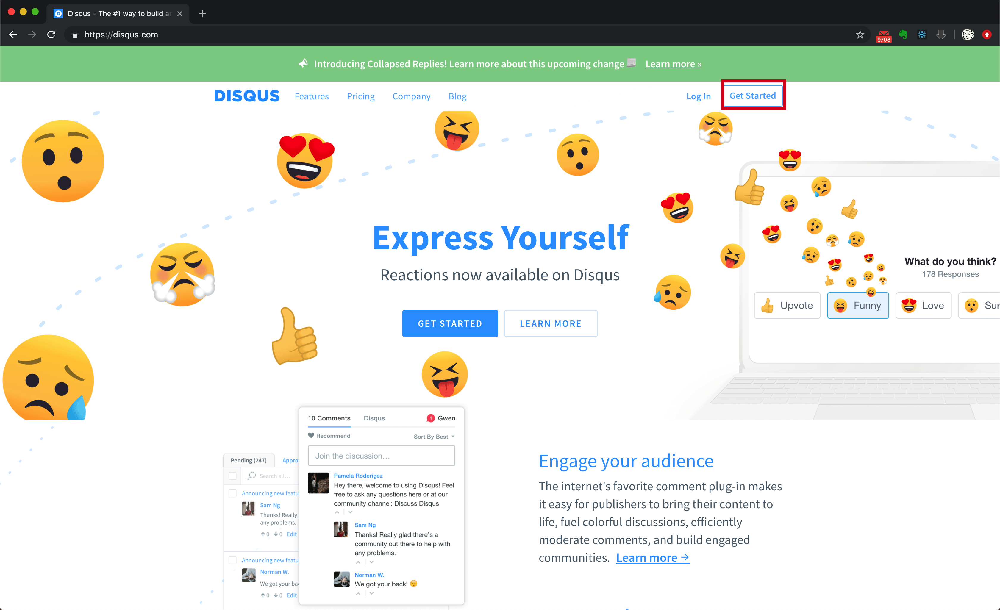  

`Get Started`를 통해 회원가입합니다.  

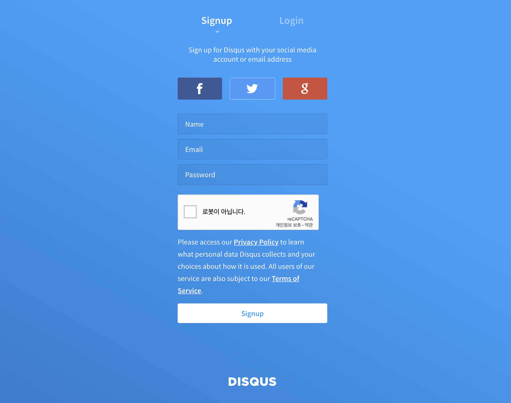  

회원가입 합시다

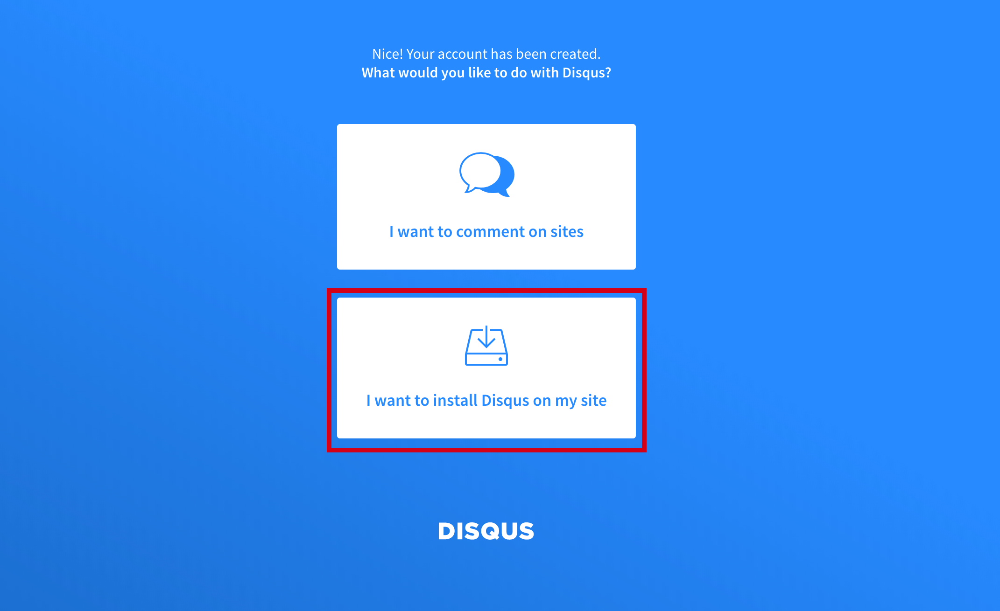

`I want to install Disqus on my site`를 선택합니다  

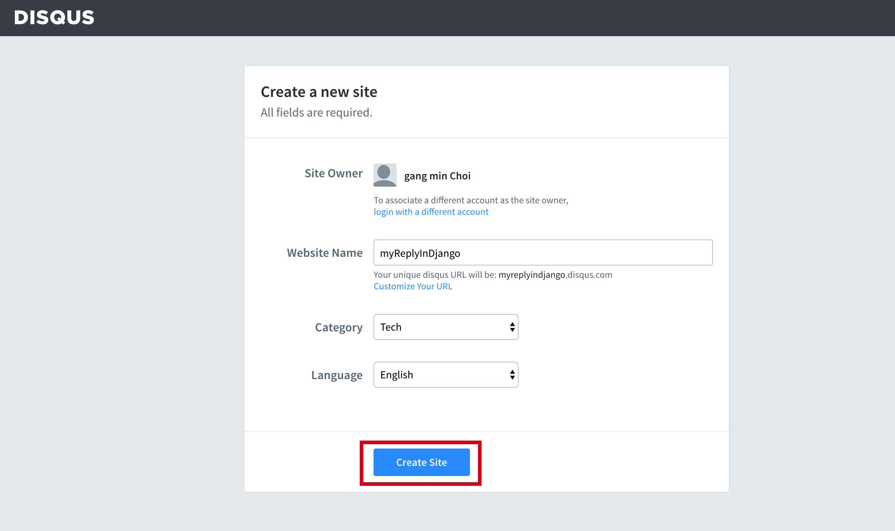

원하는 이름으로 `disqus`앱을 등록합니다

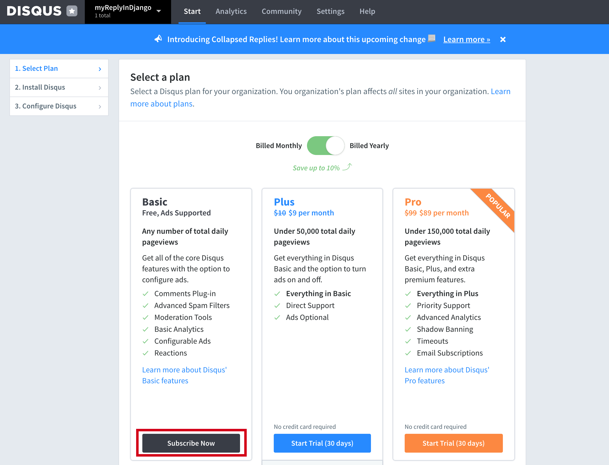

`Basic Plan`으로 진행합니다  

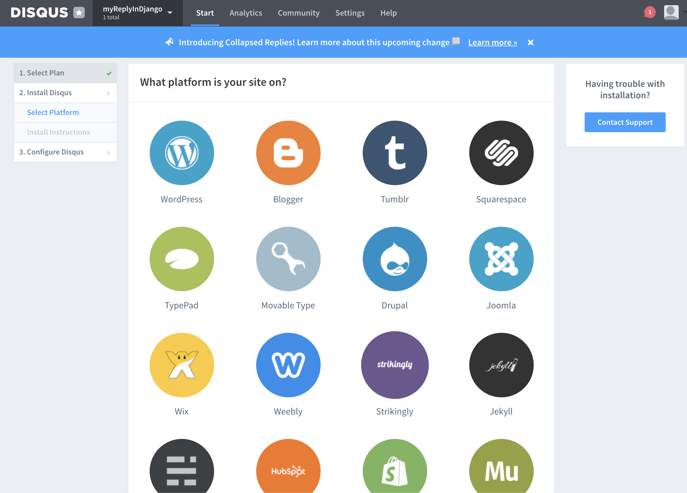

사용하는 플랫폼을 고릅니다  

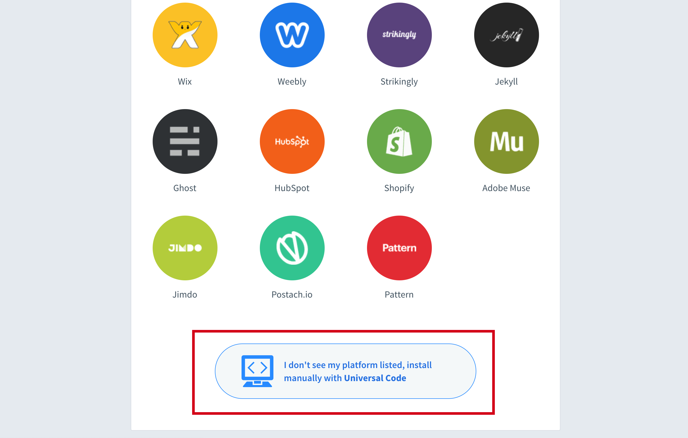

저희는 직접 개발하므로 `Universal Code`를 사용합니다  

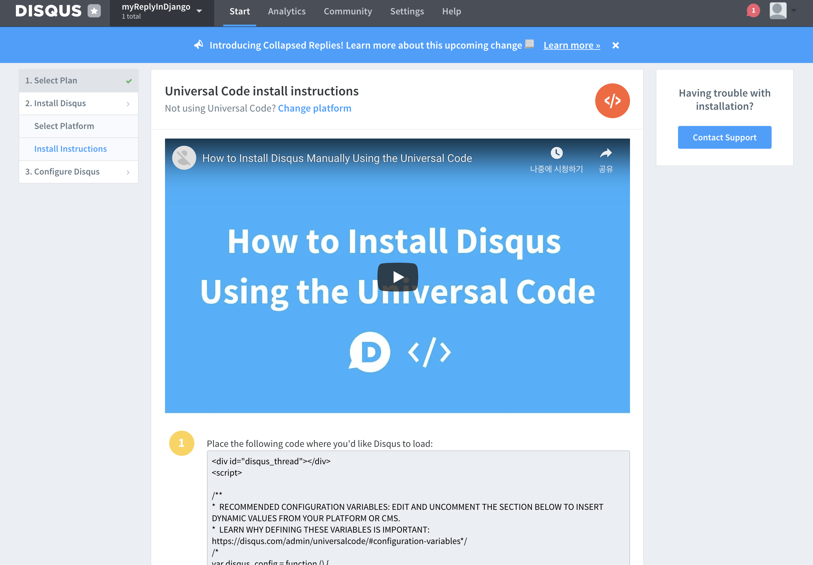  
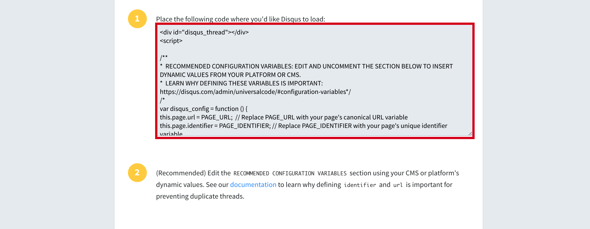  
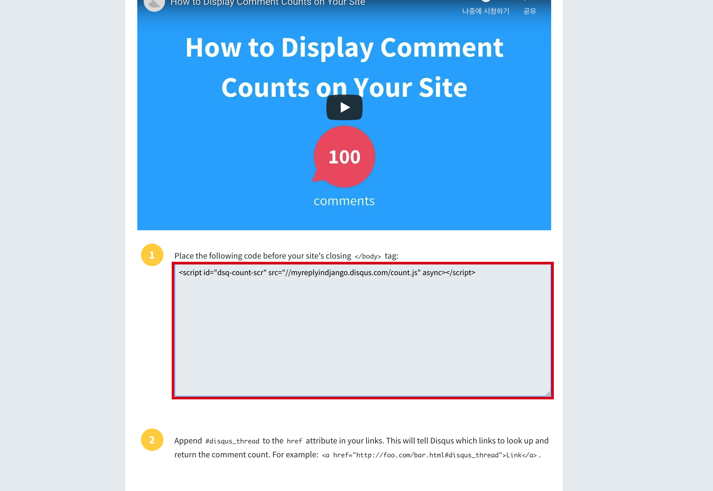  

`disqus`에서 제공하는 코드를 `posting.html`에 붙입니다  
2가지 종류의 코드를 복사해 `</body>` 바로 위에 붙입니다  

1. `Place the following code where you'd like Disqus to load:`  
2. `Place the following code before your site's closing </body> tag:`  


#### `mysite/main/templates/main/posting.html`
```html
<html>
    <head>
        <title>Posting!</title>
    </head>
    <body>
        <h1>게시글 개별 페이지입니다</h1>
        <p>{{post.postname}}</p>
        <p>{{post.contents}}</p>
        <!-- 이미지 보여주기 -->
        
            
            <br>
        
        <a href="https://haedal11233.run.goorm.io/blog/">blog</a>
        
        <!-- disqus로 댓글기능 구현하기 -->
        <div id="disqus_thread"></div>
        <script>

        /**
        *  RECOMMENDED CONFIGURATION VARIABLES: EDIT AND UNCOMMENT THE SECTION BELOW TO INSERT DYNAMIC VALUES FROM YOUR PLATFORM OR CMS.
        *  LEARN WHY DEFINING THESE VARIABLES IS IMPORTANT: https://disqus.com/admin/universalcode/#configuration-variables*/
        /*
        var disqus_config = function () {
        this.page.url = PAGE_URL;  // Replace PAGE_URL with your page's canonical URL variable
        this.page.identifier = PAGE_IDENTIFIER; // Replace PAGE_IDENTIFIER with your page's unique identifier variable
        };
        */
        (function() { // DON'T EDIT BELOW THIS LINE
        var d = document, s = d.createElement('script');
        s.src = 'https://myreplyindjango.disqus.com/embed.js';
        s.setAttribute('data-timestamp', +new Date());
        (d.head || d.body).appendChild(s);
        })();
        </script>
        <noscript>Please enable JavaScript to view the <a href="https://disqus.com/?ref_noscript">comments powered by Disqus.</a></noscript>
        
        <script id="dsq-count-scr" src="//myreplyindjango.disqus.com/count.js" async></script>
    </body>
</html>
```

아래와 같이 댓글 기능이 구현됩니다  

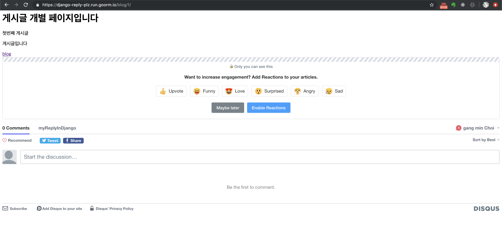

기능은 구현했지만 코드가 복잡해 가독성이 떨어집니다.  
`disqus`의 장고 버전인 `django-disqus` 패키지를 사용해   
코드를 정리해봅니다  

```console
root@goorm:/workspace/djangoBootcamp/mysite# pip3 install django-disqus
```


#### `mysite/djangobootcamp/settings.py`
```python
INSTALLED_APPS = [
    'django.contrib.admin',
    'django.contrib.auth',
    'django.contrib.contenttypes',
    'django.contrib.sessions',
    'django.contrib.messages',
    'django.contrib.staticfiles',
    # main 어플리케이션 추가
    'main',
    # 댓글 기능 추가
    'disqus',
    'django.contrib.sites'
]

# disqus에서 만든 website name
DISQUS_WEBSITE_SHORTNAME = 'myReplyinDjango'
# django site 구별자로 중복되면 안됩니다
SITE_ID = 1
```

`disqus` 앱에는 테이블 정의가 없어 `migrate` 명령이 불필요합니다.  
하지만 `django.contrib.sites`앱에는 테이블이 있어,  
`migrate` 명령이 필요합니다.  

```console
root@goorm:/workspace/djangoBootcamp/mysite# python3 manage.py makemigrations
```

```console
root@goorm:/workspace/djangoBootcamp/mysite# python3 manage.py migrate
```

장고를 활용해 코드를 정리합니다
#### `mysite/main/templates/main/posting.html`
```html
<html>
    <head>
        <title>Posting!</title>
    </head>
    <body>
        <h1>게시글 개별 페이지입니다</h1>
        <p>{{post.postname}}</p>
        <p>{{post.contents}}</p>
        <!-- 이미지 보여주기 -->
        
            
            <br>
        
        <a href="..">blog</a>
        
        <!-- disqus로 댓글기능 구현하기 -->
        <!-- 가독성 높여보자-->
        
        
    </body>
</html>
```
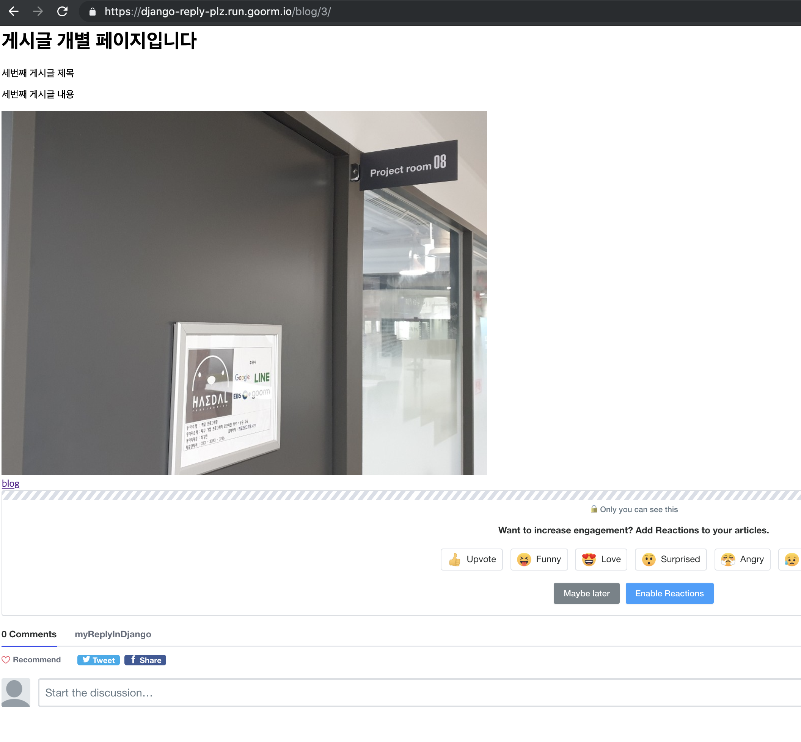  
동일하게 작동함을 확인했습니다


## 확인하기
내 웹페이지와 친구의 웹페이지에 댓글을 달아보며  
`disqus`가 정상적으로 작동하는지 확인해봅니다  
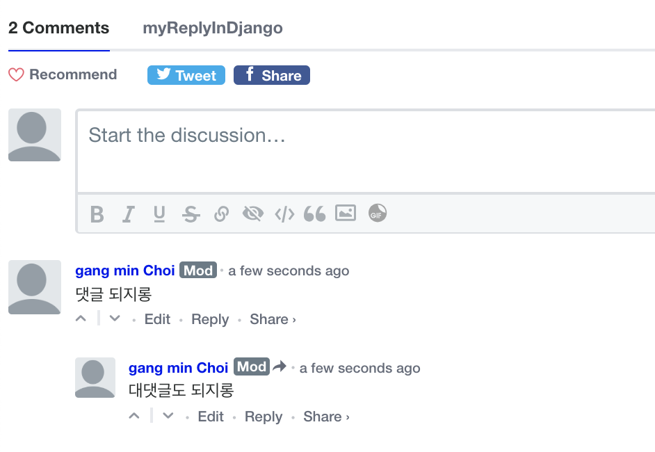


## 직접 댓글 작성하기 참고자료
[Post,Comment 모델](https://lhy.kr/lecture/django/instagram/02.post-model)


[Post에 Comment 추가하기 블로그](https://lhy.kr/lecture/django/instagram/04.comment-create)